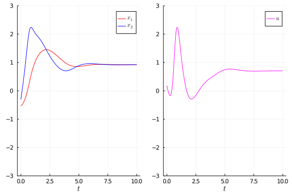

# LazyFym
**LazyFym** is a general-purpose simulator for dynamical systems.
## Notes
### Origin
The origin of the name `Fym` is from the previous versions of flight (but also general-purpose) simulators:
[fym](https://github.com/fdcl-nrf/fym) in `Python` and [FymEnvs.jl](https://github.com/fdcl-nrf/FymEnvs.jl) in `Julia`.
### Deprecated
It has taken low priority for now to improve the simulation speed when the time span is very long.

## Features
### Flexible usage pattern and nested environments
LazyFym is highly based on Julia's pipeline syntax and [Transducers.jl](https://github.com/JuliaFolds/Transducers.jl).
This makes it possible to construct a simulator using Transducers.
Since Transducers are composable, it is highly flexible to make your own simulator.
For example,
You can take either eager or lazy data postprocessing with LazyFym.
Also,
LazyFym supports **nested environments** so that users can deal with
complex dynamical systems.
### Lazy evaluation
It is possible to lazily evaluate your simulator.
To do so,
you would need to incorporate packages related to lazy evaluation
such as [InfiniteArrays.jl](https://github.com/JuliaArrays/InfiniteArrays.jl).
### Parallelism
It is not seemingly different from the sequential simulation.
For example,
you can perform simulation with various initial conditions by
replacing `collect` by `tcollect` (thread-based) or `dcollect` (process-based),
which are provided by `Transducers.jl`.
You should run Julia REPL or execute codes with an appropriate option,
for example, `julia -t 4` for thread-based parallel simulation.
### Predefined environments
LazyFym provides some predefined environments for reproducible codes.
Take a look at `src/fymenvs.jl`.
<!-- ### Performance improvement for simulations with long time span (Todo; experimental) -->
<!-- (I'm trying to apply some ideas, e.g., `PartitionedSim`, -->
<!-- but it seems slower than expected.) -->

## Interface
### Types
LazyFym provides a Type `Fym`.
`Fym` contains the information of an environment (system),
probably consisting of other `Fym`s as sub-environments (sub-systems).
### With other packages
LazyFym is highly based on `Transducers.jl` so various functionalities provided by
`Transducers.jl` can be applied.
Therefore, it is **highly recommended** to get used to `Transducers.jl` for the users of LazyFym (e.g., [glossary of Transducers.jl](https://juliafolds.github.io/Transducers.jl/dev/explanation/glossary/)).
In addition,
the following list of packages would be useful:
- [InfiniteArrays.jl](https://github.com/JuliaArrays/InfiniteArrays.jl) for dealing with infinite array and lazy evaluation
- [StructArrays.jl](https://github.com/JuliaArrays/StructArrays.jl), [DataFrames.jl](https://github.com/JuliaData/DataFrames.jl), and [JLD2.jl](https://github.com/JuliaIO/JLD2.jl) for handling simulation data

### Quick start
You can also perform numerical simulations with lazy evaluation,
nested custom environments, eager or lazy data postprocessing, and parallel simulation.
Please take a look at directory `test` (some examples may be omitted).

```julia
using LazyFym
using Transducers

using InfiniteArrays
using StructArrays
using Random
using Plots, LaTeXStrings


function ẋ(env::LazyFym.InputAffineQuadraticCostEnv, x, t)
    u = command(env, x)
    ẋ = LazyFym.ẋ(env, x, t, u)
end
_env = LazyFym.InputAffineQuadraticCostEnv()
command(env, x) = LazyFym.u_optimal(_env, x)  # you can customise it

function initial_condition(env::LazyFym.InputAffineQuadraticCostEnv)
    2*(rand(2) .- 0.5)
end

function postprocess(env::LazyFym.InputAffineQuadraticCostEnv)
    function _postprocess(_datum)
        t = _datum.t
        x = _datum.x
        u = command(env, x)
        datum = (; t = t, x = x, u = u)
    end
end

function lazy()
    Random.seed!(1)
    env = LazyFym.InputAffineQuadraticCostEnv()
    t0 = 0.0
    t1 = 10.00
    Δt = 0.01
    ts = t0:Δt:∞
    x0 = initial_condition(env)
    sim(x0) = t -> Sim(env, x0, ts, ẋ) |> TakeWhile(datum -> datum.t <= t) |> Map(postprocess(env)) |> collect |> StructArray
    traj_x0 = sim(x0)
    data = traj_x0(t1)
    l = @layout [a b]
    p_x = plot(data.t, data.x |> sequentialise,
        seriestype=:scatter, color=[:red :blue], xlabel=L"t", label=[L"x_{1}" L"x_{2}"], ylim=(-3, 3))
    p_u = plot(data.t, data.u,
        seriestype=:scatter, color=[:magenta], xlabel=L"t", label=L"u", ylim=(-3, 3))
    p = plot(p_x, p_u, layout = l)
    savefig(p, "figures/lazy.png")
end
lazy()
```

```julia
function parallel()
    Random.seed!(1)
    env = LazyFym.InputAffineQuadraticCostEnv()
    t0 = 0.0
    t1 = 10.00
    Δt = 0.01
    ts = t0:Δt:∞
    num = 10
    x0s = 1:num |> Map(i -> initial_condition(env))
    traj(x0) = Sim(env, x0, ts, ẋ) |> TakeWhile(datum -> datum.t <= t1) |> Map(postprocess(env)) |> collect
    data_parallel = x0s |> Map(x0 -> traj(x0)) |> tcollect
    data_parallel_whole = data_parallel |> TCat(Threads.nthreads()) |> collect |> StructArray 
    l = @layout [a b]
    p_x = plot(data_parallel_whole.t, data_parallel_whole.x |> sequentialise,
        color=[:red :blue], seriestype=:scatter, xlabel=L"t", label=[L"x_{1}" L"x_{2}"], ylim=(-3, 3))
    p_u = plot(data_parallel_whole.t, data_parallel_whole.u,
        color=[:magenta], seriestype=:scatter, xlabel=L"t", label=L"u", ylim=(-3, 3))
    p = plot(p_x, p_u, layout = l)
    savefig(p, "figures/parallel.png")
end
parallel()
```


## Performance Tips
### Provide environment information
Since LazyFym automatically calculate the information of environments (including size, flatten_length, etc.)
and may result in performance degeneration,
you should consider extend `LazyFym` functions for your custom environments such as `LazyFym.size`
to improve the simulation speed (about 2~3 times faster in most cases).
### Postprocess data after simulation
Postprocessing will make your simulator slow.
Postprocessing after obtaining simulation data would be beneficial if your simulation itself has bottleneck.

<!-- ## Todo -->
<!-- - [x] Nested environments (like `fym` and `FymEnvs`) -->
<!-- - [x] Performance improvement (supporting nested env. makes it slow -> can be improved by telling LazyFym the information of your custom environments) -->
<!-- - [x] Add an example of parallel simulation -->
<!-- - [ ] Performance improvement for simulations with long time span -->
